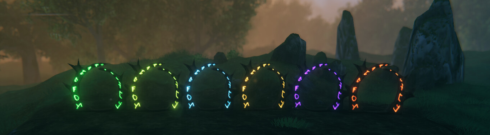
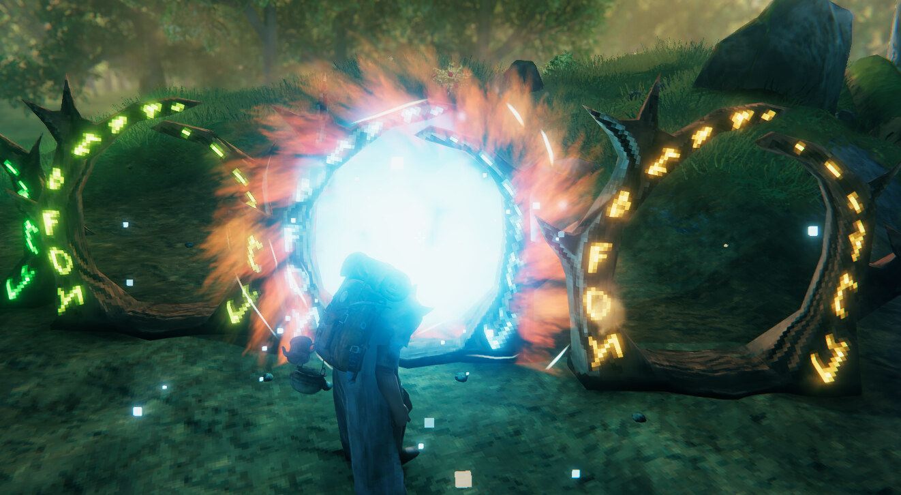
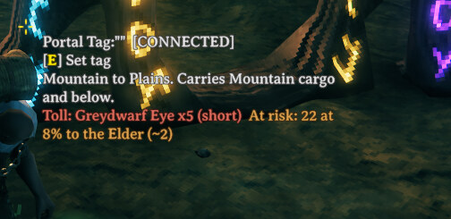
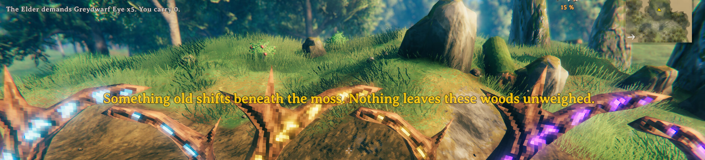

# Tollbound

A Valheim mod that replaces the vanilla all-or-nothing portal rule with a progression you
earn one biome at a time.

Vanilla gives you two answers about ore and portals: never, and then — once the stone portal
arrives — always. Tollbound fills the gap between them with six new portal pieces, each built
from its own biome's materials, each carrying a little more than the last.

Wood and stone portals behave exactly as vanilla. `portal_stone` already carries everything,
so earning it in the base game stays the natural graduation; Tollbound's whole ladder sits
before it and never patches it.

*The whole ladder, built out — Black Forest to Ashlands, left to right.*

## The rules

**Each portal is a licence with a ceiling.** A Swamp portal carries Swamp-tier cargo and
everything below it, and refuses anything above.

**Tiers connect freely; a crossing carries the lower of its two ends.** A Swamp portal linked
to a Black Forest one is a Black Forest crossing in both directions. Linked to a plain wood
portal, nothing restricted goes through at all — which is the same answer vanilla gives,
reached from the other side.

**The toll follows the cargo, not the ground you are standing on.** Every restricted item
belongs to a biome, and carrying it pays that biome's spirit wherever the trip starts.
Hauling bronze and iron out of your base costs greydwarf eyes *and* entrails.

**Boss kills decide what survives.** Leave a biome's boss alive and its spirit takes a cut of
the metal in transit, rolled once per unit. Ores and bars can be lost; dragon eggs,
extractors, cogwheels and Hildir's chests never are.

Evaluation is all-or-nothing up front: nothing is consumed unless every check passes, so a
refused crossing costs the player nothing.

*A paid crossing. Cargo in a backpack is weighed like anything else.*

## The ladder

| Portal | Cargo it adds | Toll | Loss while the boss lives | Build cost | Station |
|---|---|---|---|---|---|
| Black Forest | `CopperOre` `TinOre` `Copper` `Tin` `Bronze` `BronzeScrap` `CopperScrap` | 5 × Greydwarf eye | 8% | FineWood 20, GreydwarfEye 10, SurtlingCore 2, Copper 5 | Workbench |
| Swamp | `IronOre` `IronScrap` `Iron` | 6 × Entrails | 11% | FineWood 20, ElderBark 10, SurtlingCore 3, Iron 5 | Workbench |
| Mountain | `SilverOre` `Silver` `DragonEgg` | 4 × Freeze gland | 14% | FineWood 20, Obsidian 10, SurtlingCore 4, Silver 5 | Workbench |
| Plains | `BlackMetalScrap` `BlackMetal` | 5 × Needle | 17% | FineWood 20, Needle 10, SurtlingCore 6, BlackMetal 5 | Forge |
| Mistlands | `DvergrNeedle` `chest_hildir1-3` | 4 × Bilebag | — | YggdrasilWood 20, BlackMarble 10, SurtlingCore 8, Eitr 2 | Forge |
| Ashlands | `FlametalOre(New)` `Flametal(New)` `CharredCogwheel` `MechanicalSpring` `Ironpit` | 5 × Charred bone | 22% | Blackwood 20, Grausten 10, SurtlingCore 10, FlametalNew 5 | Forge |

Every number is a config entry. Tolls stack across every biome in the pack. Each portal costs
its own tier's metal, so the first haul out of any biome is necessarily a boat trip.

## What it does to the game

- Six portal pieces cloned from `portal_wood`, tinted per biome, each with its own rendered
  build-menu icon.
- Portal hover text naming the crossing, the toll and the metal at risk.
- The inventory no-teleport slash rewritten to reflect the nearby portal instead of vanilla's
  all-or-nothing flag.
- Per-biome spirit dialogue, composed from an editable text file.
- Backpack and map-portal mod support.

*Hover text resolves the pairing, prices the toll and names what a living boss is putting at
risk — before you step through.*

*A refusal: the itemised ledger top-left, the spirit's line centre-screen.*

## Compatibility

[AdventureBackpacks](https://github.com/Vapok/AdventureBackpacks),
[Backpacks](https://github.com/blaxxun-boop/Backpacks) and
[TargetPortal](https://github.com/blaxxun-boop/TargetPortal) are supported, as soft
dependencies bound by reflection so their updates cannot break this mod. Cargo in a backpack
is tolled and taxed like anything else; map warps are gated like walked crossings.

Tollbound portals deliberately do not set `m_allowAllItems`. Portal mods read that flag as
"no restrictions", so setting it would make a biome portal *more* permissive than a vanilla
one — an unsupported portal mod instead falls back to its own restrictions and fails closed.

Items another mod marks non-teleportable that Tollbound has no tier for are refused rather
than carried free.

## Multiplayer

Server *and* every client. The server registers the pieces and is what recognises them as
portals at all; each client evaluates its own crossings, which is the only place its
inventory is authoritative. Clients without the mod are refused at the version handshake.

Gameplay config is admin-synced; appearance config is local. Backpack contents are readable
only on the owning client, so a server cannot validate them.

## Status

Feature complete and confirmed in single-player, including every combination of the supported
third-party mods. **The multiplayer path has never been exercised** — server-side piece
registration, admin config sync and the version handshake are implemented and reasoned
through, but not verified against a real server. That is what the first release is for.

## Building

Developed inside a Valheim mod workspace that supplies `Directory.Build.props` and a
generated `Environment.props` pointing at a local Steam install, a Gale profile carrying
BepInEx and Jötunn, and a decompile of the game for reference. **It is not standalone-
buildable from a bare clone** — that will come if anyone wants to contribute.

Targets net462 against publicized game assemblies, patches via HarmonyX, and registers
content through Jötunn. No custom art or AssetBundles: the portals are the vanilla
`portal_wood` prefab cloned and re-dressed.

One trap worth repeating for anyone reading the source: Valheim's Mono runtime ships no
`System.ValueTuple`, so value tuples, records and `Span<T>` compile cleanly against the
reference assemblies and then throw `TypeLoadException` on first use. Plain classes only in
anything the game will load.

## Licence

MIT. See [LICENSE](LICENSE).
